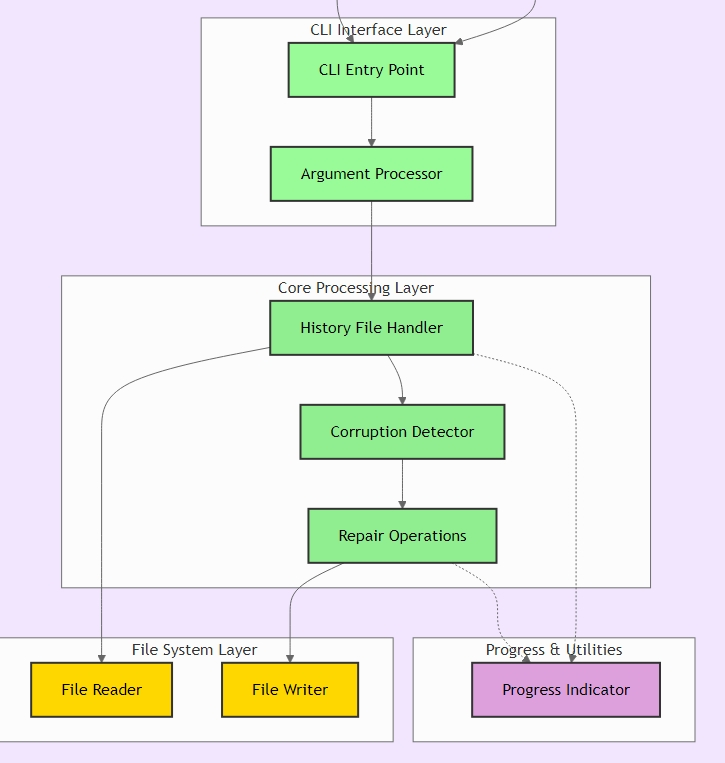

<p align="center">

<h1 style="border:none;margin:0;" align="center">Fix-zsh</h1>
<p align="center">A CLI tool to fix zsh corrupted history.</p>

<p align="center">


</p>

<p align="center">
  <!-- <a href="#about">Explore the docs »</a>    -->
  <a href="https://www.npmjs.com/package/fix-zsh">View live. </a>  
  <a href="https://github.com/aumirza/fix-zsh/issues">Report Bug. </a>   
  <a href="https://github.com/aumirza/fix-zsh/issues">Request Feature</a>
</p>

</p>

<hr/>

## 🚀 Have you came across this annoying error?

As a developer and zsh enthusiast, I often came across the annoying error:

```bash
zsh: corrupt history file /home/<user>/.zsh_history
```

This tool will fix this error and restore history.

## Installation

Not required, Just run the npx script

## Usage

```bash
npx fix-zsh@latest
```

## Features

- Easy to use
- Cross platform
- No setup required
- No installation required

## How it works

Here's Full guide on [my blog](https://blog.ahmadullah.in/troubleshooting-zsh-corrupt-history)



## Authors

- [@aumirza](https://www.github.com/aumirza)

## License

[MIT](https://choosealicense.com/licenses/mit/)

## Support

For support, email dev@ahmadullah.in
